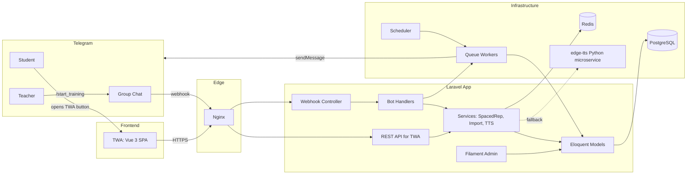
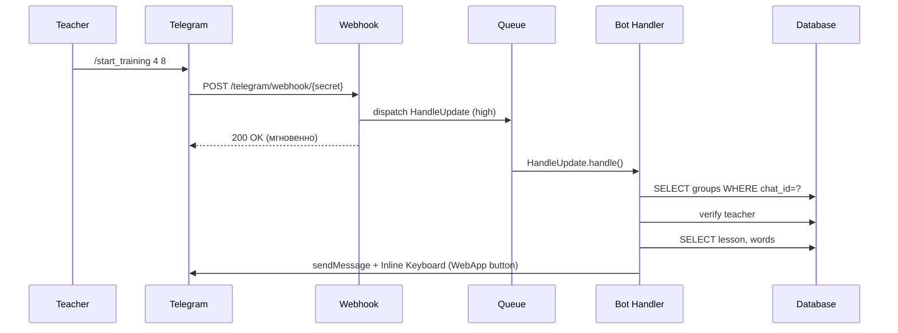
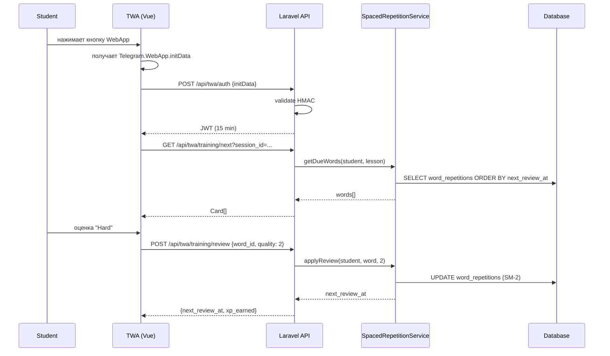
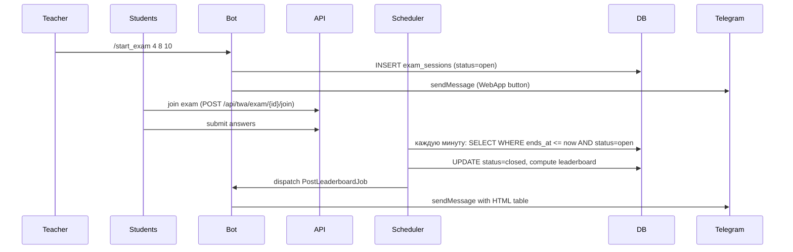

# 02. Architecture — LexiFlow Pro

## 1. Высокоуровневая архитектура



## 2. Компоненты

### 2.1 Laravel Application (монолит)
Один Laravel-проект содержит три «лица»:
- **Filament Admin** — UI для админа и учителя (`/admin`).
- **Bot Webhook** — endpoint для Telegram (`/telegram/webhook/{secret}`).
- **TWA API** — REST-эндпоинты для Web App (`/api/twa/*`).

Зачем монолит: команда маленькая, домены сильно связаны (одна БД, одна модель данных). Если когда-нибудь TWA вырастет в отдельное приложение — выделить его в Nuxt/SPA на поддомене не проблема.

### 2.2 PostgreSQL 16
Основное хранилище. Используем:
- JSONB для `meta` полей (расширяемость).
- `generated columns` для вычисляемых метрик (например, `is_hard` у `word_repetitions`).
- Транзакции для импорта и экзамена.

Альтернатива — MySQL 8 (тоже ок, но JSONB и оконные функции в Postgres удобнее для аналитики).

### 2.3 Redis 7
- **Cache:** настройки, rate limits, счётчики слов урока, готовые лидерборды закрытых экзаменов.
- **Queue:** `high` (webhook ACK), `default` (рассылки), `low` (аналитика).
- **Locks:** `Cache::lock()` для критических секций (импорт, завершение экзамена).
- Redis connection DB разделены по назначению: `default=0`, `cache=1`, `queue=2`, `session=3`, `locks=4`. Это снижает риск, что burst очередей вытеснит session/cache keys.

### 2.4 Queue Workers (Supervisor)
- Отдельные воркеры на три очереди.
- Webhook Telegram кладёт тяжёлую обработку в `high`-queue и сразу отвечает 200 OK (чтобы Telegram не ретрайил).

### 2.5 Scheduler (`schedule:run` через cron)
- Каждую минуту — `artisan schedule:run`.
- Задачи:
  - `exam:close-expired` — раз в минуту.
  - `repetitions:notify-students` — 18:00 UTC.
  - `analytics:refresh-materialized-views` — ночью.

### 2.6 Telegram Bot SDK
Рекомендация: **nutgram/nutgram** — современный, FastRoute-подобный роутинг, хорошая работа с middleware.

Альтернативы:
- `irazasyed/telegram-bot-sdk` — стабильный, но старше по стилю.
- `defstudio/telegraph` — Laravel-native, хорошая интеграция с моделями.

### 2.7 TWA Frontend
- **Vue 3** + Composition API + Pinia (state) + Vite.
- TailwindCSS для стилей.
- Сборка в `public/twa/`, отдаётся через Nginx.
- Взаимодействие с API — через `fetch` + JWT в `Authorization` header.
- Telegram SDK: `@twa-dev/sdk`.

### 2.8 edge-tts микросервис (опционально)
- Отдельный Python-контейнер на FastAPI.
- Endpoint `POST /tts` → принимает `{word, voice}` → возвращает `audio/mpeg`.
- Доступ только из внутренней сети Docker.
- Нужен только если Web Speech API плохо работает у части пользователей.

## 3. Data Flow

### 3.1 Учитель запускает тренировку



### 3.2 Студент открывает TWA и учит карточки



### 3.3 Экзамен и лидерборд



## 4. Слои приложения (Laravel)

```
Http Layer (Controllers, Middleware)
        │
        ▼
Service Layer (бизнес-логика)
        │
        ▼
Repository/Model Layer (Eloquent)
        │
        ▼
Database
```

Правила:
- Контроллеры тонкие: валидируют вход через FormRequest, зовут сервис, возвращают Resource.
- Сервисы — классы с одной ответственностью. Примеры:
  - `App\Services\SpacedRepetition\SpacedRepetitionEngine`
  - `App\Services\Import\VocabularyImporter`
  - `App\Services\Exam\ExamSession`
  - `App\Services\Exam\LeaderboardBuilder`
  - `App\Services\Telegram\TelegramGateway`
- Модели — только отношения, скоупы, аксессоры. Бизнес-логика **не** живёт в моделях.
- Jobs — обёртка вокруг сервисов для асинхронного выполнения.

## 5. Модули (package-by-feature)

Внутри `app/` организуемся по доменам:

```
app/
├── Domain/
│   ├── Content/           # Stage, Lesson, Word, Import
│   │   ├── Models/
│   │   ├── Services/
│   │   └── Jobs/
│   ├── Learning/          # WordRepetition, SpacedRepetition
│   │   ├── Models/
│   │   ├── Services/
│   │   └── Jobs/
│   ├── Exam/              # ExamSession, ExamAnswer, Leaderboard
│   ├── Group/             # TelegramGroup, Teacher, Student
│   └── Analytics/         # агрегаты, views
├── Filament/
│   ├── Resources/
│   ├── Pages/
│   └── Widgets/
├── Telegram/
│   ├── Bot.php            # bootstrap nutgram
│   ├── Commands/
│   ├── Conversations/
│   ├── Middleware/
│   │   ├── GroupLock.php
│   │   └── TeacherOnly.php
│   └── Handlers/
└── Http/
    ├── Controllers/
    │   └── Api/Twa/
    ├── Middleware/
    │   └── TwaAuth.php
    └── Resources/Twa/
```

## 6. Внешние интеграции

| Сервис | Назначение | Аутентификация |
|--------|------------|----------------|
| Telegram Bot API | Отправка сообщений, webhook | `TELEGRAM_BOT_TOKEN` |
| Telegram Web App | Встраивание TWA | `initData` HMAC по `TELEGRAM_BOT_TOKEN` |
| edge-tts (self-hosted) | Fallback TTS | internal network only |
| Sentry (опц.) | Error tracking | DSN в env |

## 7. Deployment (Docker Compose)

Сервисы:
- `app` — PHP-FPM 8.2 + Laravel.
- `nginx` — reverse proxy + static TWA.
- `postgres` — БД.
- `redis` — cache + queue.
- `worker-high`, `worker-default`, `worker-low` — Supervisor-воркеры.
- `scheduler` — cron-контейнер.
- `tts` — edge-tts FastAPI (optional).

Env vars (минимум):
```
APP_KEY=
APP_URL=https://lexiflow.example.com
DB_CONNECTION=pgsql
DB_HOST=postgres
DB_DATABASE=lexiflow
DB_USERNAME=lexiflow
DB_PASSWORD=...
REDIS_HOST=redis
REDIS_CACHE_DB=1
REDIS_QUEUE_DB=2
REDIS_SESSION_DB=3
REDIS_LOCK_DB=4
QUEUE_CONNECTION=redis
CACHE_STORE=redis
SESSION_DRIVER=redis
TELEGRAM_BOT_TOKEN=...
TELEGRAM_WEBHOOK_SECRET=...        # случайная 64-символьная строка
TWA_JWT_SECRET=...
TTS_SERVICE_URL=http://tts:8000
SENTRY_LARAVEL_DSN=
```

## 8. Observability

- **Логи:** Monolog → stdout (в Docker) в JSON-формате → агрегатор (Loki/ELK).
- **Метрики:** Laravel Telescope в dev, в prod — Prometheus exporter (через `spatie/laravel-prometheus`).
- **Трейсинг:** OpenTelemetry (опционально, на v2).
- **Error tracking:** Sentry.
- **Health endpoint:** `GET /health` → проверка DB, Redis, возвращает 200/503.

## 9. Ключевые архитектурные решения (ADR)

| # | Решение | Причина |
|---|---------|---------|
| ADR-1 | Монолит, не микросервисы | Маленькая команда, связанный домен |
| ADR-2 | PostgreSQL, не MySQL | JSONB, оконные функции для аналитики |
| ADR-3 | nutgram для бота | Лучший DX для Laravel-разработчика |
| ADR-4 | Vue 3 для TWA, не React | Простота + лёгкая сборка для single-page flow |
| ADR-5 | JWT для TWA, не session | Stateless, проще масштабировать |
| ADR-6 | Web Speech API primary, edge-tts fallback | Нулевая стоимость на базовом сценарии |
| ADR-7 | Упрощённый SM-2 | Хорошо изучен, достаточно для MVP |

## 10. Открытые архитектурные вопросы

- Стоит ли выносить TWA frontend в отдельный репозиторий сразу? (Пока: нет, в одном репо внутри `resources/twa`.)
- Нужен ли feature flags-сервис? (Для MVP — нет, config-based.)
- Multi-tenancy для разных языковых центров? (Не в MVP; если понадобится — `central_id` в ключевых таблицах и scope на уровне Filament.)
