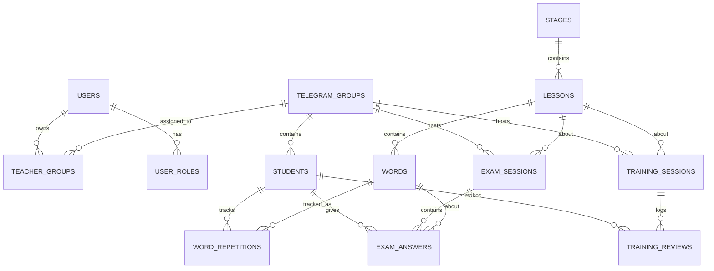

# 03. Database Schema — LexiFlow Pro

## 1. ERD



## 2. Таблицы

Все таблицы содержат `id` (bigint, PK), `created_at`, `updated_at` (если не указано иное).

### 2.1 `users` — администраторы и учителя
| Колонка | Тип | Описание |
|---------|-----|----------|
| id | bigint PK | |
| name | string(100) | ФИО |
| email | string(150) unique | Логин |
| password | string(255) | bcrypt |
| telegram_user_id | bigint nullable unique | Для учителя — обязательно, получаем из `/start` в ЛС бота |
| is_active | boolean default true | |
| last_login_at | timestamp nullable | |
| created_at, updated_at | | |

Роли через `spatie/laravel-permission`: `admin`, `teacher`.

### 2.2 `telegram_groups`
| Колонка | Тип | Описание |
|---------|-----|----------|
| id | bigint PK | |
| chat_id | bigint unique | Telegram chat_id (может быть отрицательный для supergroup) |
| title | string(255) | Название группы |
| status | enum('pending','active','disabled') default 'pending' | |
| meta | jsonb default '{}' | Member count, type и т.п. |
| created_at, updated_at | | |

**Индексы:** `chat_id` unique, `status`.

### 2.3 `teacher_groups` — pivot учитель ↔ группа
| Колонка | Тип |
|---------|-----|
| id | bigint PK |
| user_id | bigint FK → users |
| telegram_group_id | bigint FK → telegram_groups |
| is_primary | boolean default true |

**Индексы:** `(user_id, telegram_group_id)` unique.

### 2.4 `students` — Telegram-юзеры в группах
| Колонка | Тип | Описание |
|---------|-----|----------|
| id | bigint PK | |
| telegram_user_id | bigint | |
| telegram_group_id | bigint FK → telegram_groups | |
| username | string(100) nullable | |
| first_name | string(100) | |
| last_name | string(100) nullable | |
| language_code | string(10) nullable | |
| last_seen_at | timestamp nullable | |
| is_active | boolean default true | |
| created_at, updated_at | | |

**Индексы:** `(telegram_user_id, telegram_group_id)` unique, `telegram_group_id`.

Заметка: один и тот же пользователь в двух разных группах будет двумя записями — это нормально, у каждой группы своя история обучения.

### 2.5 `stages`
| Колонка | Тип |
|---------|-----|
| id | bigint PK |
| number | int unique |
| title | string(255) |
| description | text nullable |

### 2.6 `lessons`
| Колонка | Тип |
|---------|-----|
| id | bigint PK |
| stage_id | bigint FK → stages |
| number | int |
| title | string(255) nullable |

**Индексы:** `(stage_id, number)` unique.

### 2.7 `words`
| Колонка | Тип | Описание |
|---------|-----|----------|
| id | bigint PK | |
| lesson_id | bigint FK → lessons | |
| word | string(100) | английское слово |
| translation | string(500) | перевод |
| example | text nullable | пример предложения |
| part_of_speech | string(30) nullable | noun/verb/... |
| transcription | string(100) nullable | IPA |
| meta | jsonb default '{}' | |

**Индексы:** `(lesson_id, word)` unique, `lesson_id`, `word` (для поиска).

### 2.8 `word_repetitions` — состояние SM-2 для пары (студент, слово)
| Колонка | Тип | Описание |
|---------|-----|----------|
| id | bigint PK | |
| student_id | bigint FK → students | |
| word_id | bigint FK → words | |
| repetitions | smallint default 0 | счётчик успешных повторений |
| interval_days | smallint default 0 | текущий интервал в днях |
| easiness_factor | decimal(4,2) default 2.50 | EF из SM-2 |
| last_quality | smallint nullable | 0..5, последняя оценка |
| last_reviewed_at | timestamp nullable | |
| next_review_at | timestamp | индексируем для запроса «что пора повторить» |
| is_hard | boolean default false | last_quality ≤ 2 — флаг для бустинга частоты |
| meta | jsonb default '{}' | |

**Индексы:**
- `(student_id, word_id)` unique.
- `(student_id, next_review_at)` — для «что показывать».
- `(student_id, is_hard)` partial index `WHERE is_hard = true`.

### 2.9 `training_sessions`
| Колонка | Тип |
|---------|-----|
| id | bigint PK |
| telegram_group_id | bigint FK |
| lesson_id | bigint FK |
| started_by_user_id | bigint FK → users |
| status | enum('open','closed') default 'open' |
| started_at | timestamp |
| ended_at | timestamp nullable |

### 2.10 `training_reviews` — каждая оценка карточки
| Колонка | Тип |
|---------|-----|
| id | bigint PK |
| training_session_id | bigint FK |
| student_id | bigint FK |
| word_id | bigint FK |
| quality | smallint (0..5) |
| time_spent_ms | int |
| created_at | timestamp |

**Индексы:** `(student_id, created_at)`, `(word_id, quality)` для аналитики «трудных слов».

### 2.11 `exam_sessions`
| Колонка | Тип |
|---------|-----|
| id | bigint PK |
| telegram_group_id | bigint FK |
| lesson_id | bigint FK |
| started_by_user_id | bigint FK |
| status | enum('open','closed') default 'open' |
| started_at | timestamp |
| ends_at | timestamp |
| closed_at | timestamp nullable |
| config | jsonb default '{}' | — кол-во вопросов, мультипликаторы и т.п. |

**Индексы:** `status`, `ends_at` (для scheduler).

### 2.12 `exam_answers`
| Колонка | Тип |
|---------|-----|
| id | bigint PK |
| exam_session_id | bigint FK |
| student_id | bigint FK |
| word_id | bigint FK |
| selected_translation | string(500) nullable |
| is_correct | boolean |
| score | int default 0 |
| time_spent_ms | int |
| answered_at | timestamp |

**Индексы:** `(exam_session_id, student_id)`, `(student_id, answered_at)`.

### 2.13 `exam_results` (materialized-style snapshot)
Заполняется при закрытии экзамена. Денормализация для быстрого лидерборда.

| Колонка | Тип |
|---------|-----|
| id | bigint PK |
| exam_session_id | bigint FK |
| student_id | bigint FK |
| total_score | int |
| correct_count | int |
| total_count | int |
| rank | int |

**Индексы:** `(exam_session_id, rank)`.

### 2.14 `notifications_log` — аудит пушей студентам
| Колонка | Тип |
|---------|-----|
| id | bigint PK |
| student_id | bigint FK |
| type | string(50) | например, `review_reminder` |
| payload | jsonb | — что отправили |
| sent_at | timestamp |

**Индексы:** `(student_id, type, sent_at)` — rate-limit «не чаще 1 в сутки».

### 2.15 `audit_logs` — минимальный аудит админки
| Колонка | Тип |
|---------|-----|
| id | bigint PK |
| user_id | bigint FK nullable |
| action | string(100) | e.g. `import.uploaded`, `group.activated` |
| entity_type | string(100) nullable |
| entity_id | bigint nullable |
| ip | string(45) nullable |
| meta | jsonb |
| created_at | timestamp |

## 3. Порядок миграций

Миграции создаём в таком порядке (порядок имеет значение из-за FK):

1. `create_users_table` (стандартный Laravel, правим)
2. `create_permission_tables` (spatie)
3. `create_telegram_groups_table`
4. `create_teacher_groups_table`
5. `create_students_table`
6. `create_stages_table`
7. `create_lessons_table`
8. `create_words_table`
9. `create_word_repetitions_table`
10. `create_training_sessions_table`
11. `create_training_reviews_table`
12. `create_exam_sessions_table`
13. `create_exam_answers_table`
14. `create_exam_results_table`
15. `create_notifications_log_table`
16. `create_audit_logs_table`

## 4. Сидеры (для локальной разработки)

- `DemoAdminSeeder` — создаёт админа `admin@local` / `password`.
- `DemoTeacherSeeder` — создаёт учителя.
- `DemoGroupSeeder` — тестовая группа со статусом `active`.
- `DemoContentSeeder` — 2 stages × 3 lessons × 20 words (из JSON-fixture).
- `DemoStudentsSeeder` — 5 тестовых студентов.
- `DemoRepetitionsSeeder` — разбрасывает состояния SM-2 так, чтобы у некоторых слов `next_review_at <= now()`.

## 5. Ключевые запросы (примеры)

### 5.1 Слова, которые пора повторить студенту
```sql
SELECT wr.*, w.word, w.translation, w.example
FROM word_repetitions wr
JOIN words w ON w.id = wr.word_id
WHERE wr.student_id = :student_id
  AND wr.next_review_at <= NOW()
ORDER BY wr.is_hard DESC, wr.next_review_at ASC
LIMIT 30;
```

### 5.2 Топ-20 «трудных слов» по группе
```sql
SELECT w.id, w.word, w.translation,
       COUNT(*) AS attempts,
       SUM(CASE WHEN tr.quality < 3 THEN 1 ELSE 0 END)::float / COUNT(*) AS hard_ratio
FROM training_reviews tr
JOIN words w ON w.id = tr.word_id
JOIN students s ON s.id = tr.student_id
WHERE s.telegram_group_id = :group_id
  AND tr.created_at >= NOW() - INTERVAL '30 days'
GROUP BY w.id, w.word, w.translation
HAVING COUNT(*) >= 10
ORDER BY hard_ratio DESC
LIMIT 20;
```

### 5.3 Лидерборд экзамена
```sql
SELECT s.first_name, s.username, er.total_score, er.correct_count, er.rank
FROM exam_results er
JOIN students s ON s.id = er.student_id
WHERE er.exam_session_id = :session_id
ORDER BY er.rank ASC;
```

## 6. Партиционирование (на будущее)

Когда `training_reviews` или `exam_answers` перерастут 10M строк — партиционировать по `created_at` (месячные партиции Postgres). В MVP не нужно.

## 7. Бэкап-стратегия

- Ежедневно `pg_dump --format=custom` в S3-совместимое хранилище.
- Ретеншн: 14 дней + 4 еженедельных.
- Раз в месяц — тест restore в staging.

## 8. Важные правила

1. **Никогда не удаляем `words`** — только soft-deactivate (`words.is_active` — если понадобится, добавить на v2). Иначе сломается история `word_repetitions`.
2. **Удаление студента** — каскадом удаляются его `word_repetitions` и `training_reviews` (GDPR-friendly). `exam_answers` — сохраняем с анонимизацией `student_id → NULL`, чтобы статистика группы не разваливалась.
3. **FK всегда с `onDelete` явно**. Не полагайся на дефолты.
4. **Всегда транзакция** для: импорта JSON, закрытия экзамена, подсчёта лидерборда.
