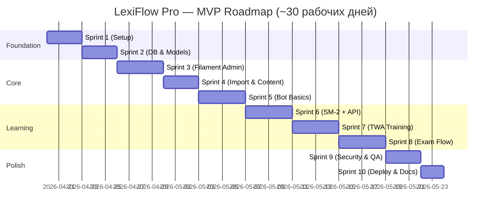

# 08. Roadmap — Пошаговый план разработки

> План рассчитан на одного разработчика (middle PHP/Laravel), работающего с AI-агентами. Время указано ориентировочное в человеко-днях (full-time).

## Обзор спринтов



---

## Sprint 1 — Foundation (3 дня)

**Цель:** Laravel-проект запускается локально через Docker, есть CI skeleton.

### Задачи
- [ ] `composer create-project laravel/laravel:^12.0 lexiflow-pro`.
- [ ] Добавить пакеты: `livewire/livewire`, `filament/filament:^5`, `spatie/laravel-permission`, `nutgram/nutgram` (или `defstudio/telegraph`), `firebase/php-jwt`, `owen-it/laravel-auditing`.
- [ ] Создать `docker-compose.yml` с сервисами: `app`, `nginx`, `postgres`, `redis`.
- [ ] Dockerfile для PHP 8.2 + FPM + расширения (`pdo_pgsql`, `redis`, `bcmath`, `intl`).
- [ ] Настроить `.env.example` по шаблону из `02_ARCHITECTURE.md`.
- [ ] Настроить `phpstan` (level 8, larastan) и `pint` (code style).
- [ ] CI: GitHub Actions — lint, phpstan, phpunit.
- [ ] `README.md` в репозитории с «как запустить локально».

### Definition of Done
- `docker compose up -d && docker compose exec app php artisan migrate && open http://localhost` → видна страница Laravel.
- `make test`, `make lint`, `make analyse` — все зелёные.

---

## Sprint 2 — Database & Models (3 дня)

**Цель:** Все таблицы из `03_DATABASE.md` созданы, модели с relationships готовы, factories/seeders позволяют поднять demo-среду.

### Задачи
- [ ] Написать 16 миграций в правильном порядке.
- [ ] Создать Eloquent-модели: `User`, `TelegramGroup`, `Student`, `Stage`, `Lesson`, `Word`, `WordRepetition`, `TrainingSession`, `TrainingReview`, `ExamSession`, `ExamAnswer`, `ExamResult`, `NotificationLog`, `AuditLog`.
- [ ] Настроить роли/permissions через spatie (`admin`, `teacher`).
- [ ] Настроить factories для всех моделей.
- [ ] Написать seeders из `03_DATABASE.md § 4`.
- [ ] Feature-тест: `php artisan migrate:fresh --seed` работает без ошибок, в БД есть demo-данные.

### Definition of Done
- `php artisan migrate:fresh --seed` успешен.
- Тест `DatabaseSchemaTest` проверяет наличие индексов и FK.
- Через `tinker` можно создать связи: student → repetition → word → lesson → stage.

---

## Sprint 3 — Filament Admin (4 дня)

**Цель:** Админ может логиниться, видеть дашборд, управлять пользователями и группами.

### Задачи
- [ ] Установить Filament, создать AdminPanel provider.
- [ ] Настроить login: email + password, rate-limit.
- [ ] Настроить 2FA (плагин `stephenjude/filament-two-factor-authentication` или вручную).
- [ ] Ресурсы:
  - `UserResource` (CRUD, назначение ролей).
  - `TelegramGroupResource` (view + activate/deactivate).
  - `StageResource` и вложенно `LessonResource`, `WordResource` (view + edit translation/example).
  - `StudentResource` (read-only + deactivate).
- [ ] Dashboard widgets:
  - `TotalStudentsWidget`.
  - `ExamsLast30DaysWidget`.
  - `ActivityChartWidget` (линейный график).
  - `TopStudentsTableWidget`.
  - `HardestWordsTableWidget`.
- [ ] Policies: admin видит всё, teacher видит только свои группы.

### Definition of Done
- `/admin` доступен, логин работает.
- Админ видит дашборд с тестовыми данными.
- Teacher после логина видит только свои группы.
- 2FA включается и работает, recovery codes.

---

## Sprint 4 — Import & Content (3 дня)

**Цель:** Админ загружает JSON-файл с уроком, данные попадают в БД с валидацией.

### Задачи
- [ ] Создать Filament-страницу `Admin\Pages\ImportLesson` с формой загрузки файла.
- [ ] `VocabularyImporter` сервис:
  - Валидация JSON-схемы.
  - Транзакционный upsert `Stage → Lesson → Words`.
  - Отчёт: `{added, updated, skipped, errors[]}`.
- [ ] Endpoint + Filament page для скачивания примера JSON.
- [ ] Аудит импорта в `audit_logs`.
- [ ] Unit-тесты на все ветки валидации (правильный JSON, отсутствует поле, превышен размер, битый unicode, дубликаты и т.д.).

### Definition of Done
- Admin загружает файл `sample-lesson.json` — 20 слов появляются в БД.
- Повторная загрузка того же файла — 0 added, 20 updated.
- Файл с ошибкой валидации — никакие данные не пишутся, админ видит список ошибок.

---

## Sprint 5 — Bot Basics (4 дня)

**Цель:** Бот принимает webhook, правильно отвечает на `/start` и `/help`, распознаёт присоединение к группе.

### Задачи
- [ ] Настроить webhook endpoint с двумя секретами (см. `07_SECURITY.md`).
- [ ] `HandleTelegramUpdate` job.
- [ ] Bootstrap nutgram с middleware `GroupLock`, `TeacherOnly`, `IgnorePrivateChats`.
- [ ] Команды:
  - `/start` в ЛС — привязка учителя по `telegram_user_id`.
  - `/help` в любом контексте.
- [ ] Событие `my_chat_member` — создание `TelegramGroup` со статусом `pending`.
- [ ] Событие новых участников → upsert `students`.
- [ ] Команда артизан `telegram:set-webhook` для регистрации URL.
- [ ] Логирование (без PII) всех incoming updates в ротируемый лог.

### Definition of Done
- Развёртываем бота на ngrok + staging.
- Добавление бота в тестовую группу создаёт запись в `telegram_groups` (pending).
- Админ через Filament активирует группу.
- `/help` в группе отвечает корректно.
- `/start` в ЛС от учителя, чей `telegram_user_id` прописан в `users` — отвечает «Привет, X».

---

## Sprint 6 — SM-2 + TWA API (4 дня)

**Цель:** Готов backend для TWA — авторизация, карточки, review, SM-2 работает.

### Задачи
- [ ] `InitDataValidator` (см. `07_SECURITY.md § 3`).
- [ ] JWT service (issue, verify).
- [ ] Endpoint `POST /api/twa/auth`.
- [ ] Middleware `TwaAuth` (проверка JWT).
- [ ] `SpacedRepetitionEngine` + полный набор unit-тестов.
- [ ] `CardPicker` сервис.
- [ ] Endpoints:
  - `GET /api/twa/me`.
  - `POST /api/twa/training/sessions/{id}/start`.
  - `GET /api/twa/training/sessions/{id}/next`.
  - `POST /api/twa/training/sessions/{id}/review`.
- [ ] Policies + feature-тесты на IDOR (чужая сессия → 403).
- [ ] Rate-limits.

### Definition of Done
- Покрытие unit-тестов SM-2 ≥ 95%.
- Feature-тест полного цикла: создание сессии → auth → next × 3 → review × 3 → интервалы в БД изменились корректно.
- Попытка доступа к чужой сессии → 403.
- Попытка `quality=99` → 422.

---

## Sprint 7 — TWA Training UI (4 дня)

**Цель:** Student может открыть TWA из бота, увидеть карточки, оценить, услышать TTS.

### Задачи
- [ ] Настроить Vite + Vue 3 + Tailwind в `resources/twa/`.
- [ ] Bootstrap + Telegram SDK.
- [ ] `useTelegram`, `useTts`, `useTimer` composables.
- [ ] `auth` store.
- [ ] `training` store.
- [ ] `TrainingView` + `FlashCard` компонент.
- [ ] «Finished» экран.
- [ ] Интеграция с API через fetch-клиент.
- [ ] Обработка ошибок (410 Gone, сетевые).
- [ ] Nginx location для `/twa/`.
- [ ] Команда бота `/start_training` постит сообщение с WebApp-кнопкой.

### Definition of Done
- На реальном Telegram iOS/Android/Desktop учитель запускает `/start_training 1 1` → студент открывает TWA → проходит 5 карточек → возвращается в Telegram. Всё работает.
- TTS произносит слово (по крайней мере на Desktop).
- Прогресс 5/25 отображается корректно.

---

## Sprint 8 — Exam Flow (4 дня)

**Цель:** Соревновательный режим с таймером, подсчётом баллов, лидербордом в чате.

### Задачи
- [ ] Endpoints экзамена (см. `04_API_AND_BOT.md § A.4`).
- [ ] `ExamQuestionBuilder` — генератор вопросов с дистракторами.
- [ ] Scheduler `exams:close-expired`.
- [ ] `LeaderboardBuilder` — считает `exam_results`.
- [ ] `PostLeaderboardJob` — постит в группу.
- [ ] `ExamView` (Vue) с таймером, вариантами, feedback.
- [ ] `ResultView` с мини-лидербордом.
- [ ] Команды `/start_exam` и `/close_exam`.

### Definition of Done
- Учитель запускает `/start_exam 1 1 2` (2 минуты).
- 2 студента открывают TWA, отвечают.
- Через 2 мин + 1 мин scheduler закрывает сессию, бот постит лидерборд с медалями.
- В Filament в логах экзаменов появилась запись.

---

## Sprint 9 — Security & QA (3 дня)

**Цель:** Проект соответствует чек-листу из `07_SECURITY.md`.

### Задачи
- [ ] Пройти по всем пунктам `07_SECURITY.md § 17`.
- [ ] Запустить OWASP ZAP baseline.
- [ ] Написать недостающие тесты (цель: 70%+ coverage).
- [ ] Подключить Sentry.
- [ ] Настроить логирование без PII.
- [ ] Lighthouse-прогон для TWA (цель: Performance ≥ 90).
- [ ] Пройтись по edge cases (обрыв сети, повторный submit, гонка на `/join`).

### Definition of Done
- Все пункты security-чеклиста отмечены.
- `composer audit` и `npm audit` — чисто.
- Покрытие тестами backend ≥ 70%.

---

## Sprint 10 — Deploy & Docs (2 дня)

**Цель:** Проект задеплоен в прод, документация обновлена.

### Задачи
- [ ] Production docker-compose.yml (отдельный от dev).
- [ ] Скрипт `deploy.sh` / Makefile.
- [ ] Настроить Let's Encrypt (caddy или certbot).
- [ ] Настроить бэкапы БД.
- [ ] Обновить `README.md` с production-инструкцией.
- [ ] Подготовить «инструкцию учителя» (1 страница).
- [ ] Smoke-test в проде.

### Definition of Done
- Проект доступен по HTTPS.
- 1 реальная группа активирована, бот отвечает.
- Backup сработал и проверен restore.

---

## После MVP (v1.1+)

| Идея | Приоритет |
|------|-----------|
| Оффлайн-очередь в TWA (ServiceWorker-less IndexedDB) | medium |
| Pre-fetch следующей карточки | low |
| Темп ответа влияет на SM-2 | low |
| Leech-detection и нотификация учителя | medium |
| Экспорт PII студента (GDPR endpoint) | high (если будет юр. требование) |
| i18n интерфейса | low |
| FSRS вместо SM-2 | low (когда будет 100k+ ответов для обучения) |
| Monitoring: Grafana + Prometheus | medium |
| Аудио-диктант (произношение → ввод) | low |

## Риски и митигации

| Риск | Вероятность | Митигация |
|------|-------------|-----------|
| Telegram API изменит формат `initData` | low | Тест на staging перед релизом; модульная валидация |
| Web Speech API не работает на iOS в Telegram WebView | **medium** | Сразу готов fallback через edge-tts |
| Учитель случайно загрузит 10MB JSON | medium | Жёсткий лимит 2MB на импорт |
| Нагрузка на воркеры при массовой рассылке напоминаний | medium | Rate-limit 20 msg/min на группу + очереди с batch |
| Gонка: 2 учителя запускают 2 экзамена одновременно в одной группе | low | Уникальный constraint `(telegram_group_id, status='open')` — не даст |

## Метрики прогресса

В процессе разработки в корне проекта ведём `PROGRESS.md`:
```
## Sprint 5
- [x] Webhook setup
- [x] GroupLock middleware
- [ ] /start handler (in progress)
```
